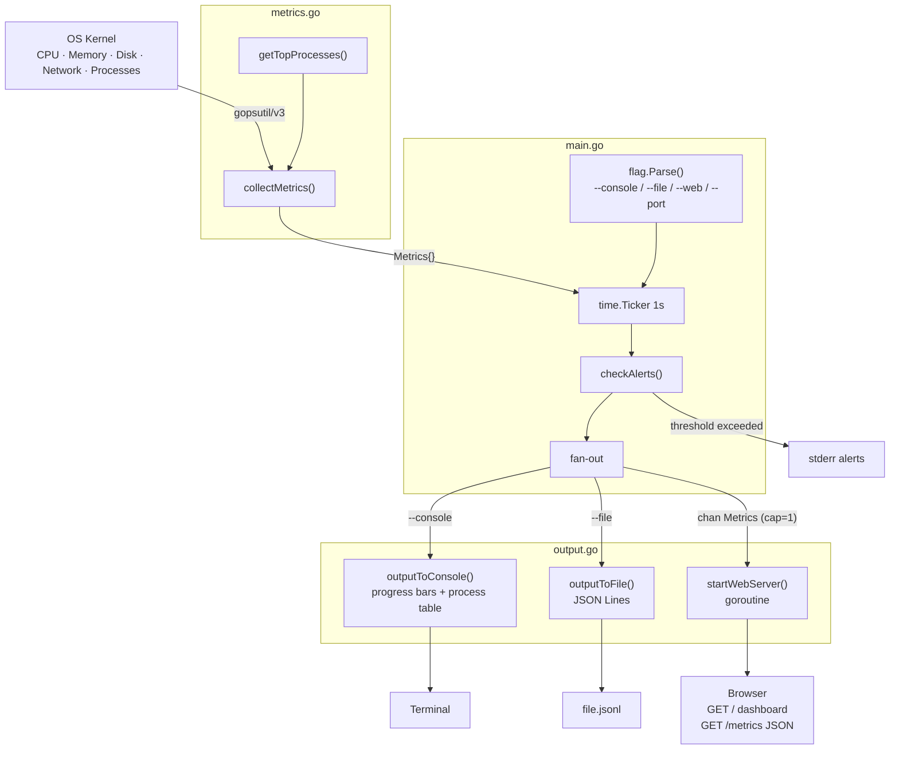

# monitor

A system metrics monitoring tool that collects CPU, memory, disk, network, and process data every second and outputs to one or more destinations.

> 中文文档：[README_zh.md](README_zh.md)

## Usage

```bash
make run                                               # console mode
make run-file                                          # console + file output
make run-web                                           # console + web server
make run-web PORT=9090                                 # custom port

# or run directly
go run . --console
go run . --file metrics.jsonl
go run . --web --port 8080
go run . --console --file out.jsonl --web --port 9090
```

At least one output flag is required. In console mode, press **q** to quit.

## Output Flags

| Flag | Description |
|------|-------------|
| `--console` | Real-time top-like display, refreshed every second |
| `--file <path>` | Append one JSON object per line to the specified file |
| `--web` | Serve latest metrics as JSON via HTTP |
| `--port <port>` | Web server port (default: `8080`) |

Multiple modes can be enabled simultaneously.

## Makefile Targets

| Target | Description |
|--------|-------------|
| `make build` | Compile to `./monitor` |
| `make run` | Build and run in console mode |
| `make run-file` | Console + write `metrics.jsonl` |
| `make run-web` | Console + web server (default port 8080) |
| `make test` | Run all tests |
| `make tidy` | Tidy go.mod / go.sum |
| `make clean` | Remove binary and log files |

## Architecture



## Project Structure

```
.
├── main.go             # Entry point: data structs, main loop, alert detection
├── metrics.go          # System metrics collection (CPU, memory, disk, network, processes)
├── output.go           # Three output handlers (console, file, web server)
├── Makefile            # Build and run targets
└── web/
    └── dashboard.html  # Web dashboard (embedded at compile time via //go:embed)
```

### main.go — Entry Point & Data Model

- **Data structs**: `Metrics`, `MemoryMetrics`, `DiskMetrics`, `NetworkMetrics`, `ProcessMetrics` (all JSON-serializable)
- **CLI parsing**: `--console`, `--file`, `--web`, `--port` via standard `flag` package
- **Main loop**: 1-second ticker, collects metrics and fans out to enabled outputs
- **Alert detection**: `checkAlerts()` logs to stderr when thresholds are exceeded
- **Quit**: press `q` in console mode to exit cleanly (raw terminal mode)
- **Channel design**: buffered channel (cap=1) to web server; non-blocking `select/default` prevents blocking the main loop

### metrics.go — Metrics Collection

Collects system metrics via [`gopsutil/v3`](https://github.com/shirou/gopsutil):

| Function | Description |
|----------|-------------|
| `collectMetrics()` | Collects all metrics and returns a `Metrics` snapshot |
| `getTopProcesses(n)` | Returns top n processes sorted by CPU usage (descending) |

Collected metrics:
- **CPU**: average usage across all cores (1-second sample interval)
- **Memory**: total, used, usage percent (physical RAM)
- **Disk**: root filesystem `/` — total, free, usage percent
- **Network**: cumulative bytes/packets sent and received across all interfaces
- **Processes**: top 10 by CPU (PID, name, CPU%, MEM%)

### output.go — Output Handlers

| Function | Description |
|----------|-------------|
| `outputToConsole(metrics)` | Clears screen and redraws; simulates `top`-like in-place refresh |
| `outputToFile(metrics, path)` | Appends JSON-serialized metrics to file (one record per line) |
| `startWebServer(port, ch)` | Starts Gin HTTP server; `GET /` serves dashboard, `GET /metrics` returns JSON |
| `bar(percent, width)` | Renders a text progress bar |
| `truncate(s, n)` | Truncates a string to n runes with ellipsis |

The web server runs in a separate goroutine and receives metrics via a channel. HTTP handlers always serve the most recently collected snapshot.

## Console Example

```
System Monitor — 2026-03-20 10:00:00

CPU:    [################                        ]  42.0%
Memory: [####################                    ]  51.3%  (8388 MB / 16384 MB)
Disk:   [########################                ]  60.1%  (150 GB free / 512 GB total)

Network: ↑ 1024 MB sent   ↓ 2048 MB recv

  PID     NAME                                CPU%      MEM%
  ------------------------------------------------------------
  1234    firefox                            5.20%     3.10%
  ...

[q] quit
```

## Alerts

Warnings are logged to stderr when thresholds are exceeded:

| Metric | Threshold |
|--------|-----------|
| CPU usage | > 80% |
| Memory usage | > 90% |
| Disk usage | > 95% |

## Build

```bash
make build    # compile
make test     # run tests
make tidy     # tidy dependencies
make clean    # remove binary
```

## Requirements

- Go 1.21+
- Dependencies (installed via `go mod tidy`):
  - [`github.com/shirou/gopsutil/v3`](https://github.com/shirou/gopsutil) — cross-platform system metrics
  - [`github.com/gin-gonic/gin`](https://github.com/gin-gonic/gin) — HTTP server
  - [`golang.org/x/term`](https://pkg.go.dev/golang.org/x/term) — raw terminal mode for keypress detection
