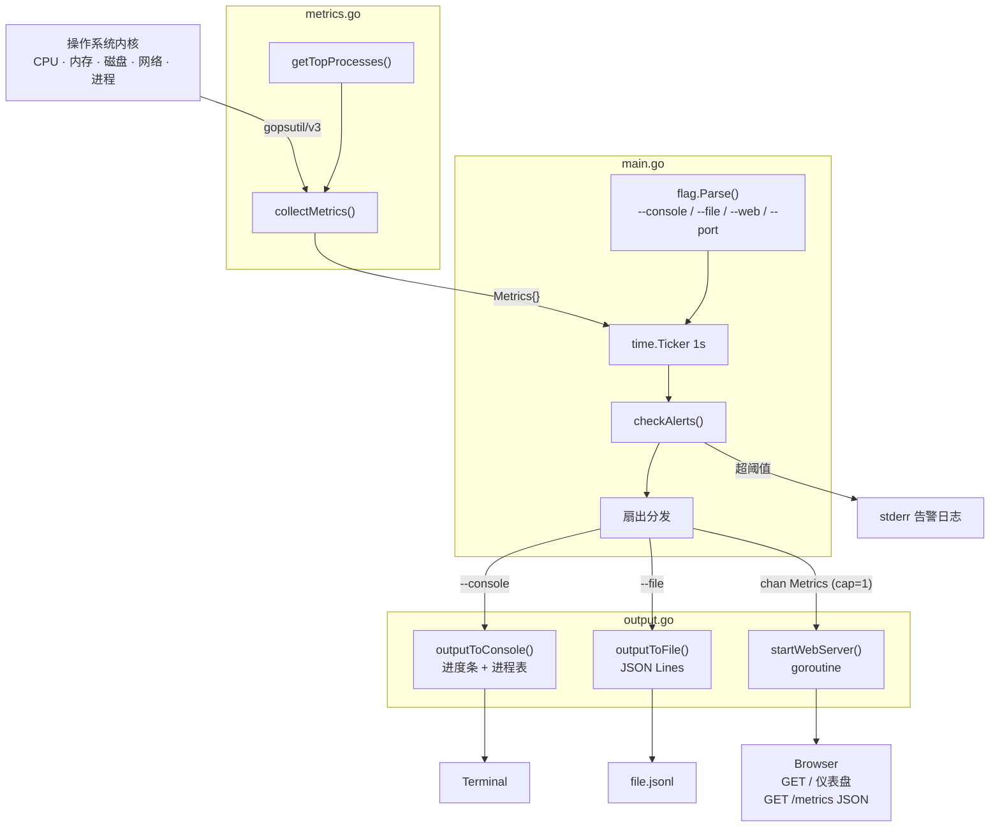

# monitor

系统指标监控工具，每秒采集 CPU、内存、磁盘、网络和进程数据，支持多种输出目标同时输出。

> English documentation: [README.md](README.md)

## 使用方法

```bash
make run                                               # 控制台模式
make run-file                                          # 控制台 + 文件输出
make run-web                                           # 控制台 + Web 服务器
make run-web PORT=9090                                 # 自定义端口

# 或直接运行
go run . --console
go run . --file metrics.jsonl
go run . --web --port 8080
go run . --console --file out.jsonl --web --port 9090
```

至少需要指定一种输出模式，否则程序退出并报错。控制台模式下按 **q** 退出。

## 命令行参数

| 参数 | 说明 |
|------|------|
| `--console` | 实时类 top 终端显示，每秒刷新 |
| `--file <path>` | 将指标以 JSON Lines 格式追加写入指定文件 |
| `--web` | 通过 HTTP 提供最新指标 JSON |
| `--port <port>` | Web 服务器监听端口（默认：`8080`） |

多种模式可同时启用，互不干扰。

## Makefile 目标

| 目标 | 说明 |
|------|------|
| `make build` | 编译生成 `./monitor` |
| `make run` | 编译并以控制台模式运行 |
| `make run-file` | 控制台 + 写入 `metrics.jsonl` |
| `make run-web` | 控制台 + Web 服务器（默认端口 8080） |
| `make test` | 运行所有单元测试 |
| `make tidy` | 整理 go.mod / go.sum 依赖 |
| `make clean` | 删除编译产物和日志文件 |

## 架构示意图



## 项目结构

```
.
├── main.go             # 程序入口：数据结构、主循环、告警检测
├── metrics.go          # 系统指标采集（CPU、内存、磁盘、网络、进程）
├── output.go           # 三种输出处理器（终端、文件、Web 服务器）
├── Makefile            # 构建与运行脚本
└── web/
    └── dashboard.html  # Web 仪表盘页面（编译时通过 //go:embed 打包）
```

### main.go — 程序入口与数据模型

- **数据结构**：`Metrics`、`MemoryMetrics`、`DiskMetrics`、`NetworkMetrics`、`ProcessMetrics`，均支持 JSON 序列化
- **命令行解析**：使用标准库 `flag` 解析 `--console`、`--file`、`--web`、`--port`
- **主循环**：每秒触发一次采集，将结果分发给各输出模块
- **告警检测**：`checkAlerts()` 在指标超阈值时向 stderr 输出告警日志
- **退出**：控制台模式下按 `q` 干净退出（raw 终端模式）
- **通道设计**：容量为 1 的带缓冲通道向 Web 服务器推送指标，非阻塞 `select/default` 保证主循环不被阻塞

### metrics.go — 系统指标采集

通过 [`gopsutil/v3`](https://github.com/shirou/gopsutil) 采集各项系统指标：

| 函数 | 说明 |
|------|------|
| `collectMetrics()` | 一次性采集所有指标并返回 `Metrics` 快照 |
| `getTopProcesses(n)` | 遍历所有进程，按 CPU 使用率降序返回前 n 个 |

采集项包括：
- **CPU**：全核平均使用率，采样间隔 1 秒
- **内存**：总量、已用量、使用率（物理 RAM）
- **磁盘**：根文件系统 `/` 的总量、剩余空间、使用率
- **网络**：所有网络接口的累计发送/接收字节数及数据包数
- **进程**：CPU 占用最高的前 10 个进程（PID、名称、CPU%、内存%）

进程采集失败时降级为空列表，不影响其他指标的正常输出。

### output.go — 输出处理器

| 函数 | 说明 |
|------|------|
| `outputToConsole(metrics)` | 清屏后重绘终端界面，模拟 `top` 的原地刷新效果 |
| `outputToFile(metrics, path)` | 将指标序列化为 JSON 后追加到文件（每行一条记录） |
| `startWebServer(port, ch)` | 启动 Gin HTTP 服务器，`GET /` 返回仪表盘，`GET /metrics` 返回 JSON |
| `bar(percent, width)` | 生成文本进度条，用于终端显示 |
| `truncate(s, n)` | 将字符串截断到 n 个字符，超出部分加省略号 |

Web 服务器在独立 goroutine 中运行，通过通道接收主循环推送的最新指标，HTTP 请求始终读取最近一次采集结果。

## 控制台示例

```
System Monitor — 2026-03-20 10:00:00

CPU:    [################                        ]  42.0%
Memory: [####################                    ]  51.3%  (8388 MB / 16384 MB)
Disk:   [########################                ]  60.1%  (150 GB free / 512 GB total)

Network: ↑ 1024 MB sent   ↓ 2048 MB recv

  PID     NAME                                CPU%      MEM%
  ------------------------------------------------------------
  1234    firefox                            5.20%     3.10%
  ...

[q] quit
```

终端界面每秒清屏重绘，效果类似 `top`。

## 告警阈值

当指标超过以下阈值时，告警信息会输出到 stderr：

| 指标 | 阈值 |
|------|------|
| CPU 使用率 | > 80% |
| 内存使用率 | > 90% |
| 磁盘使用率 | > 95% |

## 编译

```bash
make build    # 编译
make test     # 运行测试
make tidy     # 整理依赖
make clean    # 删除产物
```

## 环境要求

- Go 1.21+
- 依赖库（通过 `go mod tidy` 安装）：
  - [`github.com/shirou/gopsutil/v3`](https://github.com/shirou/gopsutil) — 跨平台系统指标采集
  - [`github.com/gin-gonic/gin`](https://github.com/gin-gonic/gin) — HTTP 服务器
  - [`golang.org/x/term`](https://pkg.go.dev/golang.org/x/term) — raw 终端模式，用于按键检测
